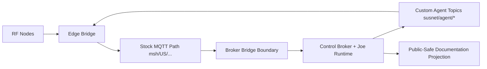

# System Map (Public-Safe)

## Component Taxonomy
- RF Node: Meshtastic radios.
- Edge Layer: MeshBox bridge and stock broker functions.
- Control Layer: Susnet broker and Joe runtime functions.
- Public Documentation Layer: this repo as sanitized projection.

## Relationship Map

## Linked Docs
- [Permission Gates Overview](permission-gates-overview.md)
- [Stock Meshtastic MQTT Contract](../contracts/stock-meshtastic-mqtt-contract.md)
- [Custom MeshBox-Susnet Agent Contract](../contracts/custom-meshbox-susnet-agent-contract.md)
- [Public Docs Map](../PUBLIC_DOCS_MAP.md)
