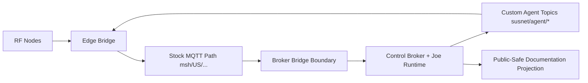

# System Map (Public-Safe)

## Component Taxonomy
- RF Node: Meshtastic radios.
- Edge Layer: MeshBox bridge and stock broker functions.
- Control Layer: Susnet broker and Joe runtime functions.
- Public Documentation Layer: this repo as sanitized projection.

## Relationship Map

## Surface Split
- Stock transport surface: Meshtastic-compatible path and payload behavior.
- Edge policy surface: Mr. Pink gate, routing, pacing, and relay controls.
- Control runtime surface: Joe + OpenClaw/Ollama execution and lifecycle emissions.
- Permission gate surface: identity/authz/ACL/schema budget controls.

## Linked Docs
- [Cross-Host Component Map](cross-host-component-map.md)
- [Surface: Stock Meshtastic](surfaces/stock-meshtastic.md)
- [Surface: Edge Bridge Mr. Pink](surfaces/edge-bridge-mr-pink.md)
- [Surface: Control Runtime Joe OpenClaw](surfaces/control-runtime-joe-openclaw.md)
- [Surface: Permission Gates](surfaces/permission-gates.md)
- [Permission Gates Overview](permission-gates-overview.md)
- [Container Runtime and Gates](container-runtime-and-gates.md)
- [Stock Meshtastic MQTT Contract](../contracts/stock-meshtastic-mqtt-contract.md)
- [Custom MeshBox-Susnet Agent Contract](../contracts/custom-meshbox-susnet-agent-contract.md)
- [Refactor Governance](../refactors/README.md)
- [Public Docs Map](../PUBLIC_DOCS_MAP.md)
