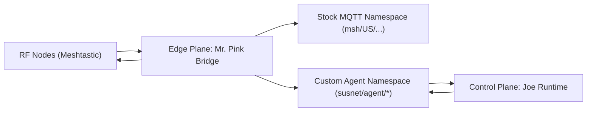
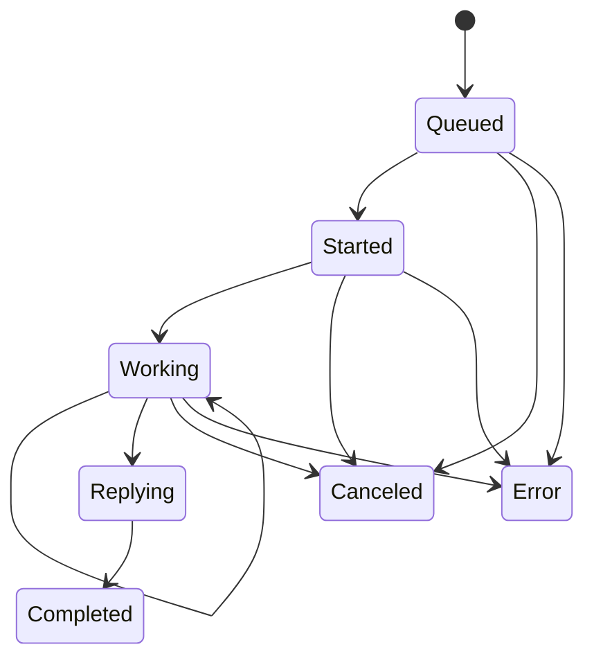

# Reservoir Pi(s) Technical Paper: Current System State and Phase 2 LLM/Agent Integration

Status: public-safe, architecture-level, no secrets  
Version: 2026-02-27  
Audience: operators, maintainers, integrators, automation agents

## 1. Executive Summary
Reservoir Pi(s) currently runs a two-plane distributed assistant pattern:
- Edge plane (`Mr. Pink`): receives Meshtastic traffic, enforces channel/sender policy, decides escalation, and relays responses.
- Control plane (`Joe` runtime): processes escalated requests and emits lifecycle replies back to the edge plane.

The system is now in a stabilized transitional state:
- Stock Meshtastic MQTT path is preserved for compatibility.
- Custom `susnet/agent/*` contract is the control-plane RPC-like path.
- Authorization uses channel identity (name + fingerprint) and sender allowlist, not channel index.
- Outbound relay behavior was hardened for ordering, pacing, and duplicate suppression.

The next major step is replacing lightweight control responses with a full LLM + agent stack while preserving the existing transport and gate semantics.

## 2. Scope and Non-Scope
### 2.1 In Scope
- Runtime architecture and control boundaries.
- Message contracts and lifecycle semantics.
- Permission gates and denial behavior.
- Operational failure modes observed during stabilization.
- Phase 2 design for full LLM/agent integration.

### 2.2 Out of Scope
- Secrets, credentials, private addresses, and direct access commands.
- Private host hardening internals beyond policy-level descriptions.
- Model vendor selection at account-specific procurement level.

## 3. Current Runtime Architecture
### 3.1 Logical View

### 3.2 Runtime Surfaces
| Surface | Runtime Form | Responsibility |
| --- | --- | --- |
| Edge broker | container | stock MQTT transport + ACL enforcement |
| Edge bridge (`Mr. Pink`) | container | ingress parse, policy gate, escalation orchestration, relay |
| Control broker | container/service | custom query/reply topic transport |
| Joe runtime | container/service | request processing and lifecycle output |

### 3.3 Data Paths
1. Ingress arrives on stock MQTT-compatible Meshtastic path.
2. Edge parser extracts packet metadata and channel identity context.
3. Policy engine decides one of:
   - local response
   - actionable-denied response
   - escalation to Joe
4. On escalation, edge publishes `susnet/agent/query`.
5. Joe emits `ack/progress/reply/error` as available.
6. Edge correlates by `request_id`, assembles chunks, relays to stock path and RF path as configured.

## 4. Contract Semantics in Current State
### 4.1 Stock Path
- Purpose: strict compatibility with Meshtastic topic and payload architecture.
- Constraint: no custom authorization or control semantics should depend on stock topic index.
- Behavior: can carry encrypted payloads; broker inspection does not imply decryptability.

### 4.2 Custom Path (`susnet/agent/*`)
- Query topic: `susnet/agent/query`
- Lifecycle topics:
  - `susnet/agent/ack`
  - `susnet/agent/progress`
  - `susnet/agent/reply`
  - `susnet/agent/error` (optional failure path)
  - `susnet/agent/dlq` (invalid/orphan handling path)

### 4.3 Correlation Model
- `request_id` is mandatory correlation key.
- `session_id` groups related lifecycle events.
- `sender`, `channel_name`, `channel_fingerprint` preserve identity continuity.
- `channel_index` is retained as transport metadata only.

## 5. Permission and Safety Gates
### 5.1 Gate Chain
1. Broker authentication gate.
2. Topic ACL gate.
3. Edge policy gate:
   - dedicated channel identity check (name + fingerprint)
   - sender allowlist for actionable intents
4. Control schema gate for custom envelopes.
5. Output budget gate (chunk count, chunk size, pacing).

### 5.2 Critical Rule
Authorization logic must never use channel index as identity authority.  
Reason: channel index drift across nodes can produce false denies, false allows, or ghost-channel relays.

### 5.3 Deny and Fallback Behavior
- Unauthorized actionable intent: deny with safe explanatory message.
- Malformed envelope: send to DLQ/error path.
- Timeout: inform sender and optionally fall back to local lightweight behavior.
- Oversized output: bounded chunks or refusal/rephrase message.

## 6. Operational Stabilization Work Completed
### 6.1 High-Impact Fixes
- Dedicated-channel identity routing anchored to channel fingerprint/name.
- Callback deadlock removal in lifecycle handler path.
- Single-relay guard to avoid duplicate final reply emissions.
- FIFO outbound send sequencing to prevent cross-thread leapfrog.
- Minimum inter-chunk delay enforcement for multi-chunk payloads.

### 6.2 Why This Work Felt Expensive
This cycle had high integration friction due to multi-surface coupling:
- stock transport behavior and custom contract behavior overlapped in one runtime.
- asynchronous callbacks masked ordering and lock-contention bugs.
- some failures looked like transport bugs but were actually state-transition bugs.
- several issues only reproduced under live traffic, not synthetic one-shot probes.

### 6.3 Lessons Learned
- Keep authorization identity explicit and immutable through the full pipeline.
- Separate transport metadata from permission metadata in both code and docs.
- Avoid lock re-entry patterns in callback contexts.
- Treat “response looked too fast” as an ordering signal, not a UX-only issue.
- Add policy-event diagnostics for every branch in lifecycle callbacks.

## 7. Current Limitations
### 7.1 Joe Runtime Capability
- Current lightweight runtime provides bounded utility responses and deterministic fallback.
- It is not yet the full intended OpenClaw-like multi-tool autonomous stack.

### 7.2 Functional Gaps
- No full model-backed planning/execution loop for rich requests.
- Limited long-context reasoning and tool orchestration.
- Error semantics are present but can be expanded with richer machine-readable codes.

## 8. Phase 2: Full LLM + Agent Stack Integration
### 8.1 Objective
Insert a production LLM/agent runtime behind current `susnet/agent/*` contract without breaking edge transport and gate behavior.

### 8.2 Design Principle
Contract-first upgrade:
- Keep `query/ack/progress/reply/error` topics stable.
- Upgrade Joe internals, not edge-facing envelope semantics.

### 8.3 Proposed Internal Control-Plane Layers
1. Ingress Validator:
   - schema validation
   - TTL checks
   - dedupe on `request_id`
2. Session Coordinator:
   - state machine for `queued -> started -> progress* -> reply* -> completed/error`
   - cancellation and timeout control
3. Planner/Router:
   - decides model-only vs tool-augmented execution
4. Tool Sandbox:
   - constrained tool execution with explicit allowlist
5. Model Runtime:
   - selected LLM backend with bounded output policy
6. Response Packager:
   - chunk-aware, RF-safe text shaping with deterministic ordering metadata

### 8.4 Recommended Runtime State Machine

### 8.5 Phase 2 Contract Requirements
- Preserve existing keys:
  - `request_id`
  - `session_id`
  - `sender`
  - `channel_fingerprint`
  - `channel_name`
- Preserve lifecycle topics and ordering guarantees.
- Add optional forward-compatible fields only (no required-breaking changes).

### 8.6 Guardrails for LLM Output
- hard `max_output_chars`
- hard `rf_max_chunks`
- hard `rf_chunk_chars`
- no word-splitting across chunks
- deterministic truncation with explicit fallback text

### 8.7 Performance Targets (Policy-Level)
- fast ACK after query ingest
- periodic progress heartbeat for long tasks
- bounded total response window
- explicit timeout and cancellation feedback

## 9. Implementation Plan for Phase 2
### 9.1 Step 1: Shadow Mode
- Run LLM pipeline in parallel with lightweight path.
- Publish diagnostics only, no user-facing relay changes.
- Compare outputs for safety, latency, and budget compliance.

### 9.2 Step 2: Controlled Cutover
- Route selected request classes to LLM path.
- Keep fallback to lightweight mode on timeout/error.
- Maintain existing gate chain unchanged.

### 9.3 Step 3: Full Production Mode
- Default to LLM stack for eligible requests.
- Keep lightweight path as resilient fallback.
- Expand tool capabilities incrementally with strict allowlists.

## 10. Verification Strategy
### 10.1 Contract Conformance
- each query yields lifecycle-consistent event sequence
- malformed envelopes route to error/DLQ behavior

### 10.2 Permission Behavior
- unauthorized actionable requests are denied
- authorized requests pass within documented scope only

### 10.3 Ordering and Timing
- no out-of-order chunk indices at relay
- inter-chunk pacing meets configured minimum
- no duplicate final reply emissions per request

### 10.4 Failure Injection
- broker disconnect/reconnect
- delayed reply and timeout paths
- orphan progress/reply handling
- cancellation during active work

## 11. Documentation and Governance Requirements for Phase 2
- update contract docs before enabling new required fields
- update permission-gate docs when any authz logic changes
- append journal/logbook/changelog for each stabilization wave
- maintain public sanitization constraints for all examples

## 12. Conclusion
The system now has a stable transport and permission-gate foundation suitable for a full LLM + agent upgrade.  
Phase 2 should focus on upgrading Joe internals while preserving edge contracts and gate semantics, minimizing operational risk and preventing a second wave of protocol churn.
